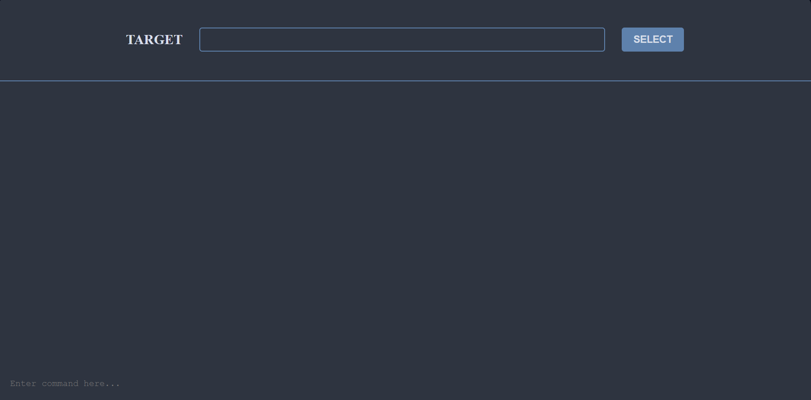

# Shadow Gate



## Description

Hello,
I’ve developed a project involving a "Backdoor" that creates a Flask server on the victim's machine. This server generates a Serveo link, which is then sent to a Discord server via a webhook. The attacker can retrieve this link and use it with the Shadowgate client to establish a remote shell, allowing them to execute commands on the target machine.

## Warning

⚠️ **Warning!**
This script was created for educational purposes only. I am not responsible for how you use it. Please use this script only on machines that you own. Using it on a machine that does not belong to you without permission is illegal.

1. Clone this repository:
   ```
    git clone https://github.com/votre-utilisateur/shadow-gate.git
    ```

2. Installation: 
    ```
    cd backdoor-shadowgate
    pip install -r requirements.txt
    ```

3. Setup:
    ```

    Modify the **self.webhook_url** variable (line 64)

    ```

4. Execution:
    ```bash
    python ShadowGate.py.py
    python ClientShadowGate.py
    ```

** INFO **
the script was created in version 3.12.4 of python